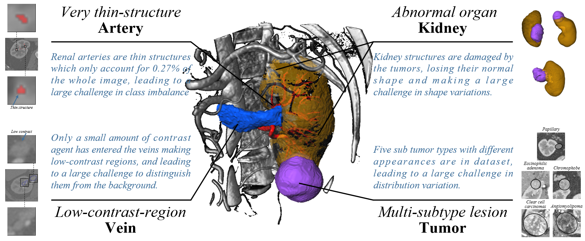

# Official repository of MICCAI 2022 Challenge: [KiPA22](https://kipa22.grand-challenge.org/).

We provide the evaluation code and a [BASELINE depository](https://github.com/KiPA2022/kipa22/tree/main/BASELINES) for a easy start of our challenge. You can use the code in [`EVALUATION`](https://github.com/KiPA2022/kipa22/tree/main/EVALUATION) to evaluate the `DSC`, `HD`, and `AVD` of your result, and use the code in `BASELINES` to strat your KiPA22 easily.

Please feel free to raise any issues if you have questions about the challenge, e.g., dataset, evaluation measures, ranking scheme and so on.

## EVALUATION
The `EVALUATION` folder provides the official implementation of the [evaluation metrics](https://kipa22.grand-challenge.org/evaluation-details/) used in the KiPA22 Challenge, including:

-`DSC`
-`HD`
-`AVD`
